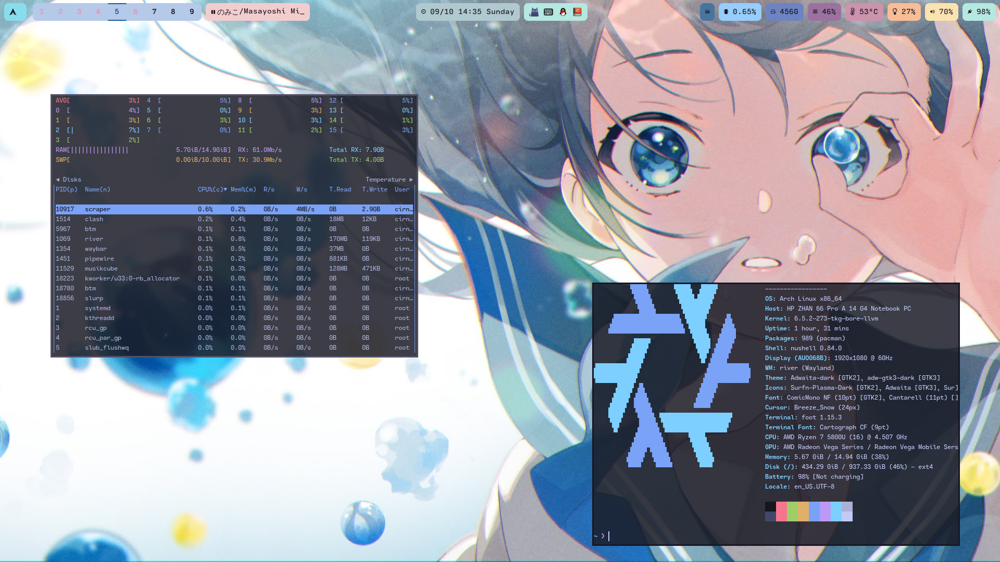

# My Arch dotfiles
- Window Manager: [Hyprland](https://github.com/hyprwm/Hyprland) || [River](https://github.com/riverwm/river) || [NIRI](https://github.com/YaLTeR/niri) 
- Bar: [Waybar](https://github.com/Alexays/Waybar)
- Shell: [NuShell](https://github.com/nushell/nushell) || [Fish](https://github.com/fish-shell/fish-shell)
- Terminal: [Foot](https://codeberg.org/dnkl/foot)
- Editor:   [Helix](https://github.com/helix-editor/helix)

## ScreenShot

